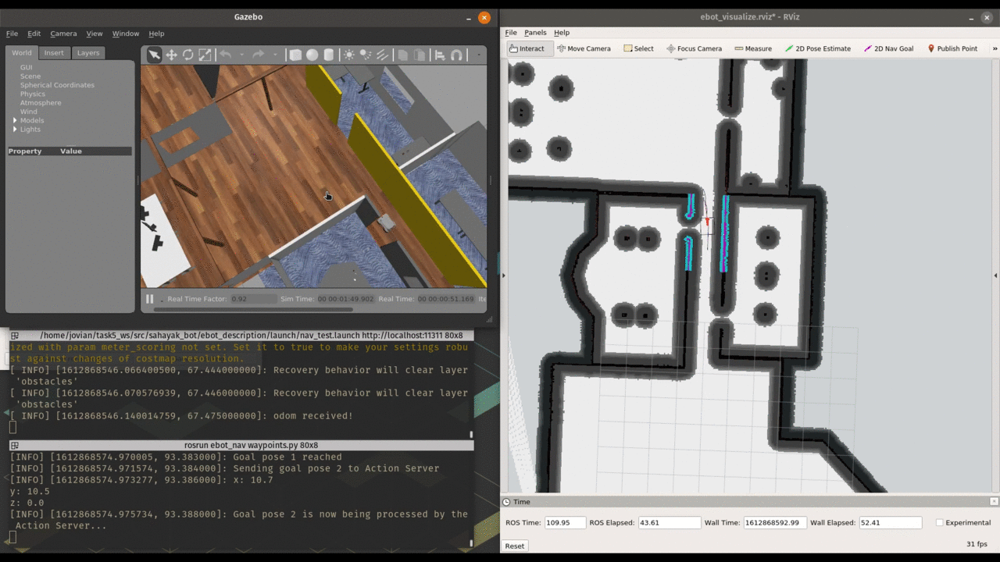

# **_Sahayak Bot_**
"Sahayak Bot" which translates to "Helper Bot", is meant to help in doing all the boring office stuff such as moving an item for one place to another. Technically, It is a mobile robot equipped with a UR5 robotic arm. It is capable of autonomously navigating in an office environment. It uses a combination machine learning and point cloud features to detect various objects , Grasp them using the robotic arm and deliver them to different locations. 


Sahayak bot


## Core packages
The code has been put into logical ROS packages to make the code modular and reusable. Some of the core packages include :

| Package | Description |
| :---:   | :---: |
| ebot_nav | This contains all the config files and test_scripts for navigation |
| ebot_mani | This contains the manipulator code to perform pick and place operations |
| perception | This defines the object detection and pose estimation scripts |
| ebot_main | This ties all the packages together to perform the main task |

## Installation

### Cloning this repo 
```bash
mkdir -p ~/catkin_ws/src
cd ~/catkin_ws/src && git clone https://github.com/Jovian-Dsouza/sahayak_bot
```

###  ROS installation and Prerequisites

- Follow the Official Installation instruction from the [ROS-Melodic](http://wiki.ros.org/melodic/Installation/Ubuntu) website. 

- or use the `ros_install.sh`, which is configured to install ROS melodic on Ubuntu 18.04 

```bash
cd ~/catkin_ws/src/sahayak_bot
sudo chmod +x ros_install.sh
./ros_install.sh

#Install Prerequisites
sudo chmod +x install.sh
./install.sh
```

### Creating alias 

- Append these lines to `.bashrc`

```bash
source ~/catkin_ws/devel/setup.bash
alias cm="catkin_make -C ~/catkin_ws && source ~/catkin_ws/devel/setup.bash"
```

- For `zsh` append these lines to `.zshrc`

```bash
source /opt/ros/melodic/setup.zsh
source ~/catkin_ws/devel/setup.zsh
alias cm="catkin_make -C ~/catkin_ws && source ~/catkin_ws/devel/setup.zsh"
source ~/catkin_ws/src/sahayak_bot/ebot_nav/scripts/locations.sh
```

- Finally source `.bashrc'

```bash
source ~/.bashrc
```

### Build the workspace 

- We are using `catkin_make` to build the workspace. 

```bash
cd ~/catkin_ws
catkin_make

#OR use the alias cm to build and source the workspace
cm
```

### Testing

```
roslaunch ebot_description task5.launch
```
